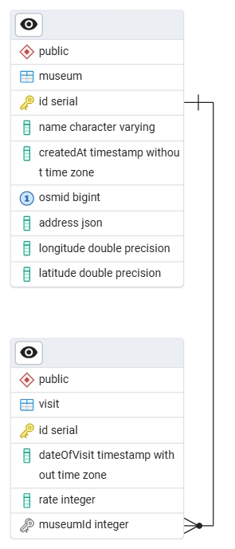

# Museums Tracker

## Introduction

This is a [Yarn](https://yarnpkg.com/) monorepository for the Museums Tracker web app frontend + REST API backend.

There are 3 submodules in this monorepository:

- [`@xintre/frontend`](/frontend/) - a [Next.js](https://nextjs.org) SPA (Single-Page App) project bootstrapped with [`create-next-app`](https://nextjs.org/docs/app/api-reference/cli/create-next-app), powered by [MUI](https://mui.com/) that uses [TanStack React Query](https://tanstack.com/query/) for data fetching / mutations, offering the user a GUI to browse existing museums on as pins on a map [React Leaflet](https://react-leaflet.js.org/) and accordion and create new ones using [Nominatim](https://nominatim.openstreetmap.org/ui/search.html) search engine for browsing places.
- [`@xintre/backend`](/backend/) - a Node.js Express.js-powered API REST backend that persists museums using Typeorm ORM DB with a PostgreSQL backend and support for pagination.
- [`@xintre/shared`](/shared/) that contains the shared code (DTOs - Data Transport Objects - typings to achieve type-safety in API-frontend communication code).

## Table of contents

- [Museums Tracker](#museums-tracker)
    - [Introduction](#introduction)
    - [Table of contents](#table-of-contents)
    - [Screenshots 📸](#screenshots-)
    - [Code style 🧑‍💻](#code-style-)
    - [Technical details 🛠](#technical-details-)
        - [Languages \& frameworks](#languages--frameworks)
        - [Libraries](#libraries)
            - [Frontend 🌸](#frontend-)
            - [Backend 💻](#backend-)
            - [Shared 🌐](#shared-)
    - [Available scripts 📜](#available-scripts-)
    - [Tooling](#tooling)
    - [Get started 🚀️](#get-started-️)
        - [Run in **production** mode](#run-in-production-mode)
        - [Run in **development** mode](#run-in-development-mode)

## Screenshots 📸

<details>
  <summary>ERD diagram of the DB</summary>
    
</details>
<details>
  <summary>Museums view screen - dark & light mode</summary>
    
    
</details>
<details>
  <summary>Museums view screen - listing museums</summary>
    
</details>
<details>
  <summary>Museums view screen - editing museum name</summary>
    
</details>
<details>
  <summary>Museums add screen - searching & adding a musuem</summary>
    
    
</details>

## Code style 🧑‍💻

This project uses the following tools:

- Prettier for code formatting
- ESLint for code linting
- lefthook for git hooks to lint code before commits & stylecheck with prettier

## Technical details 🛠

### Languages & frameworks

- [Next.js](https://nextjs.org) - React framework
- [React](https://reactjs.org) - JavaScript library for building user interfaces
- [TypeScript](https://www.typescriptlang.org) - JavaScript superset with type annotations

### Libraries

#### Frontend 🌸

- [TanStack/react-query](https://react-query.tanstack.com) - data fetching and caching library; underlying connectivity with REST endpoints implemented using `fetch` in [`utils/apiClient.ts`](utils/apiClient.ts)
- `leaflet` - interactive map library
- `react-leaflet` - React wrapper for Leaflet
- `@mui/material` - Material-UI components
- `@mui/icons-material` - Material-UI icons
- `@mui/material-next-js` - Material-UI integration with Next.js
- `@uidotdev/usehooks` - collection of React hooks
- `moment` - for parsing & formatting dates

#### Backend 💻

- `express.js` - creation of REST API endpoints
- `helmet` - Express.js security configuration + limiting unnecessary headers
- `axios` - HTTP client for making requests to external APIs (Nominatim)
- `typeorm` - ORM (Object-Relational Mapping) database
- `cors` - enabling CORS (Cross-Origin Resource Sharing)
- `morgan` - logging HTTP requests to Express.js
- `signale` - pretty logging
- `zod` - json data types validation
- `yargs` - command-line argument parsing
- `pg` - non-blocking PostgreSQL client for Node.js, DB connector backend for TypeORM
- `ts-patch` - modified TSC compiler with support for custom transformers, in this project I am using `typescript-transform-paths` to automatically replace proper paths to custom aliases defined in `tsconfig.json` (`@/...` imports of local code from project root)

#### Shared 🌐

- `dotenv` - loading of environment variables from `.env` files
- `concurrently` - for running multiple commands concurrently
- `lefthook` - git hooks
- `prettier` - code formatting
- `eslint` - code linting
- `@commitlint/cli` + `@commitlint/config-conventional` - linting commit messages to comply with conventional commits specification

## Available scripts 📜

- `build` - runs parallelly build command in every workspace, if present
- `start` - runs concurrently start command in frontend & backend workspace
- `dev` - runs concurrently dev command in frontend & backend workspace
- `dev:backend` - runs dev command in backend workspace
- `dev:frontend` - runs dev command in backend workspace
- `postinstall` - installs lefthook to git hooks
- `stylecheck` - runs parallelly stylecheck command in every workspace, if present
- `lint` - runs parallelly lint command in every workspace, if present

## Tooling

- GH Actions for CI
- `eslint` & `prettier` for code linting and formatting
- `lefthook` for pre-commit & pre-push hooks
- `ts-node` for running TypeScript files on-the-fly without compilation in development mode (backend)
- `ts-patch` for transformer-supporting TSC compiler
- `typescript-transform-paths` to automatically replace proper paths to custom aliases defined in `tsconfig.json` (`@/...` imports of local code from project root) in the backend project

## Get started 🚀️

### Run in **production** mode

Install dependencies with:

```bash
yarn
```

Build & run the prebuilt app:

```bash
yarn build
yarn start
```

### Run in **development** mode

Install dependencies with:

```bash
yarn
```

Run the frontend in dev watch mode (Next.js development server) & the backend in watch mode (auto-restart thanks to `ts-node-dev`):

```bash
yarn dev
```
